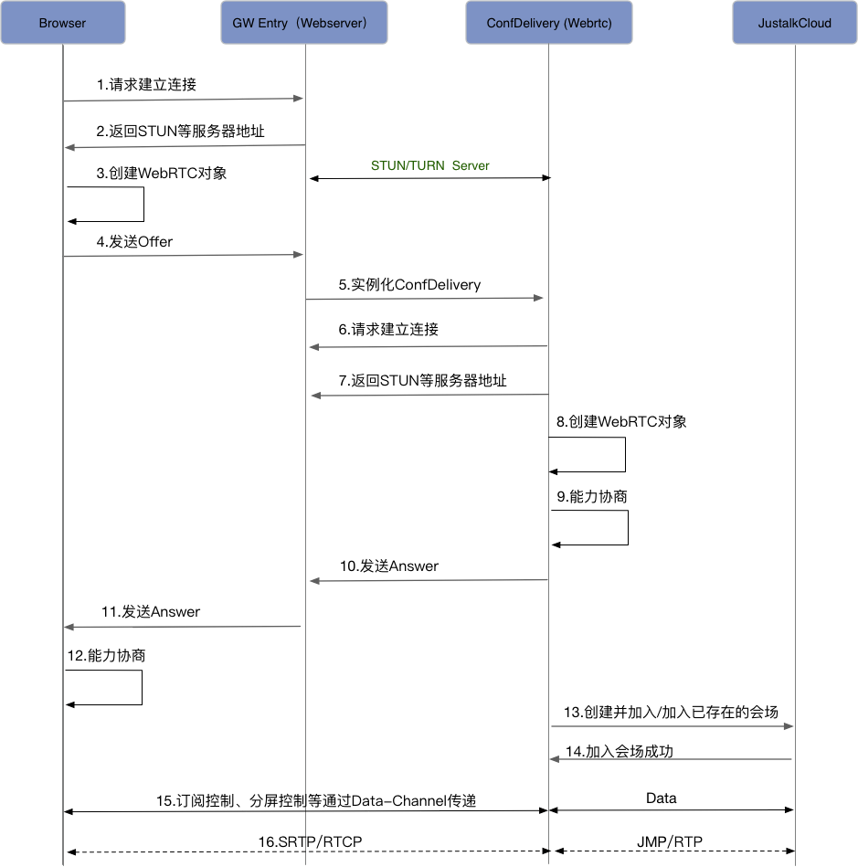

## 基于Kurento Server的AppRTC Docker-compose构建步骤  

- 说明 ：现在基于此方案搭建的服务大致分为以下三个模块: (每块已经全部打入docker镜像)  

1. STUN Server(基于java实现):  
构建镜像路径指定为上一个目录的stun/dockerfile文件，使用端口1111    
单一执行命令如下：
```
docker run --name mileworks-stun -p 1111:1111 -d mileworks/stun  
```
2. TURN Server : ([打洞服务器](https://github.com/coturn/coturn)之前使用的是官方提供的地址并且教程[参考](https://blog.csdn.net/day_day_up1991/article/details/52253892),现在替换使用的是官方[docker hub](https://store.docker.com/community/images/steppechange/docker-coturn)的镜像，最终配置turn服务器参数如下（还是使用之前的配置）:  
```
lt-cred-mech 用户 :   ./turnadmin -a -u mileworks -p 1234qwer -r mileworks
admins 用户 :   ./turnadmin -A -u mileworks -p 1234qwer -r mileworks
根据用户名、密码、realm计算出值  : ./turnadmin -k -u mileworks -p 1234qwer -r mileworks
计算出来 :  0x9ad8153416b11cc6fe823a2075d60f07
```
使用端口:3478 / 用户名:mileworks / 密码:1234qwer ，如下配置到下面 turnserver.conf
```
Create container and run:
  docker run -d -t steppechange/docker-coturn
Check inside:
  docker exec -it -t 8d422f552416 /bin/bash
Check volume path:
  docker inspect steppechange/docker-coturn
```
【注意配置文件路径映射IP地址修改！】

3. Signaling Server/Room Server ：
    - Kurento server ：这里使用的官方[docker hub](https://store.docker.com/community/images/kurento/kurento-media-server)，使用端口 8888  
    单一执行命令如下：
    ```
    Create container and run:
      docker run --name kms -p 8888:8888 -d kurento/kurento-media-server  
    Check inside:
      docker exec -it -t 843 /bin/bash
    Check volume path:
      docker inspect kurento/kurento-media-server
    ```
    【注意配置文件路径映射IP地址修改！】

    - Singnal Server : 使用 unidata/tomcat-docker [支持SSL的镜像](https://store.docker.com/community/images/unidata/tomcat-docker)  
      使用[jWebrtc](https://github.com/inspiraluna/AppRTC-Kurento)
      主要用于现有客户端（web、ios、安卓）三个端的socket信道通讯 , 这里最终打包成war包之后放入tomcat中(此tomcat需要使用SSL，[配置方法](https://www.oschina.net/question/12_23148))
      现在已经全部打入docker中。  

      (重)jWebrtc工程代码 WebSocketServer.java 类中439行 需要修改后期部署turnserver/stunserver的url地址，由于客户端中不再配置相应的地址，全部由服务器给。然后重新构建war包，复制到webrtc目录中。

    - 构建镜像路径指定为上一个目录的webrtc/dockerfile文件,使用tomcat默认SSL端口 8433  

- 注意：两个文件 kurento/WebRtcEndpoint.conf.ini 和 tomcat/Dockerfile : <u>在每次部署的时候记得把其中配置ip 的地方换成自己实际部署ip</u>


也可直接执行如下命令:（会执行所有包含组件）
```
1. 确认当前服务器IP地址。
2. 修改WebRtcEndpoint.conf.ini /WebSocketServer.java 中三个涉及IP 的地方。
3. docker-compose up --build  -d
4. 设置环境变量（注意在dockerfile中的书写）： export JAVA_OPTS="$JAVA_OPTS -Dkms.url=ws://localhost:8888/kurento -DSTUN_URL=stun:<<stun-ip>>:1111 -DTURN_USERNAME=mileworks -DTURN_PASSWORD=1234qwer -DTURN_URL=turn:<<turn-ip>>:3478"
```
附件：webrtc流程图



